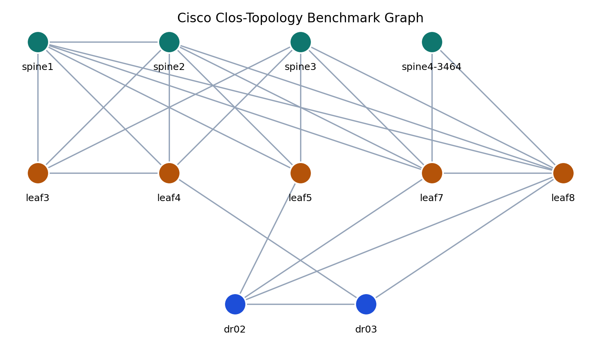
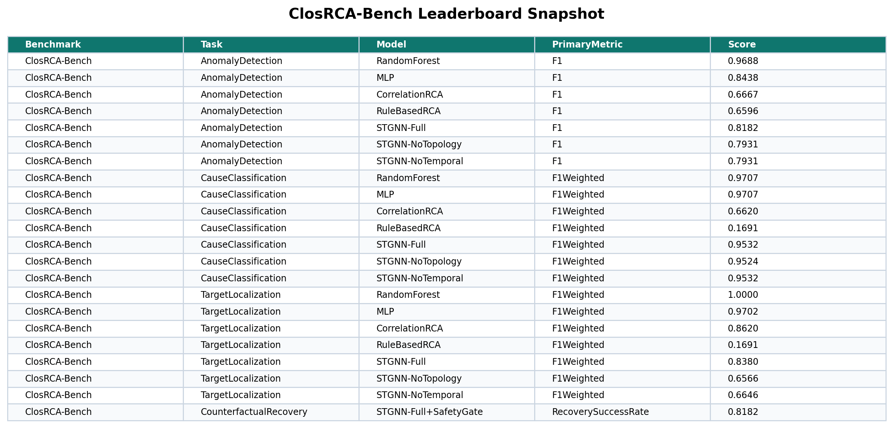
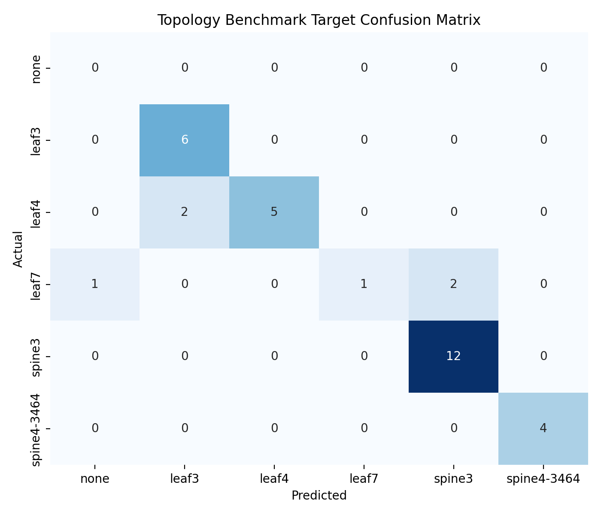
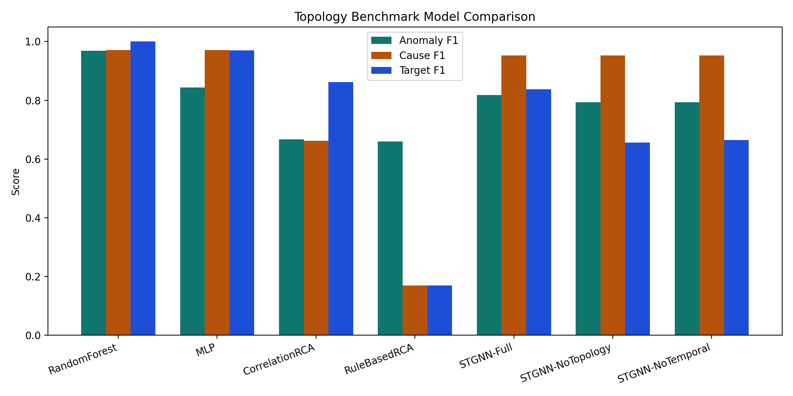
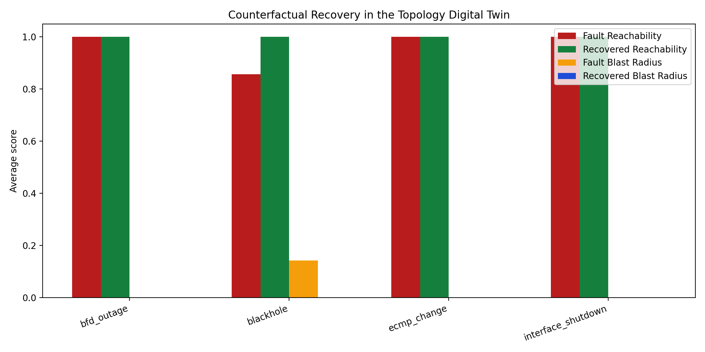
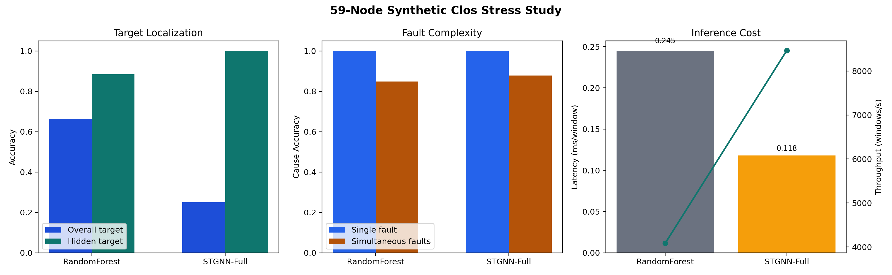
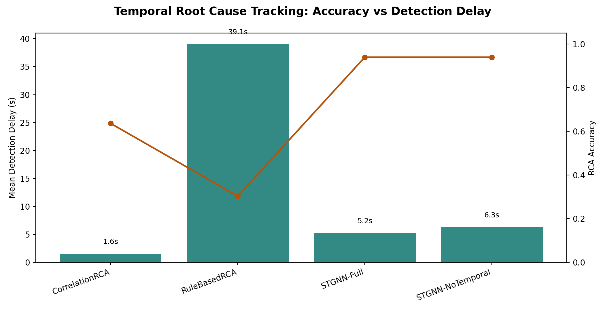
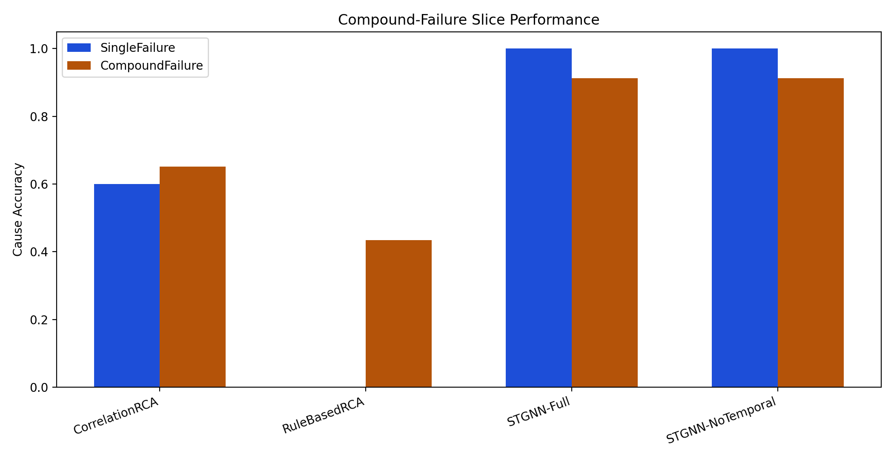
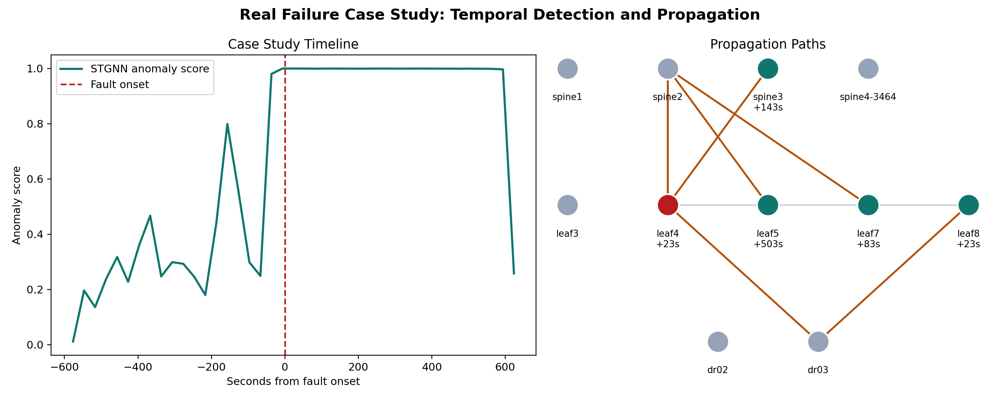
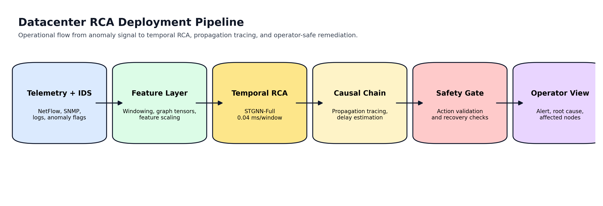

# ClosRCA-Bench

[](LICENSE)
[](requirements.txt)
[](https://github.com/dheerajramasahayam/clos-rca-bench/releases)
[](benchmark_protocol/README.md)
[](https://doi.org/10.5281/zenodo.19059194)

ClosRCA-Bench is a maintained public research artifact for topology-grounded datacenter root-cause analysis. The benchmark turns Cisco's public Clos-topology telemetry scenarios into fixed graph windows for anomaly detection, cause classification, target-device localization, and counterfactual remediation validation, with a specific emphasis on hidden-target cases where the failing device is not directly monitored.

The maintained manuscript source is [paper.tex](/Users/dheerajramasahayam/Desktop/Projects/clos-rca-bench/paper.tex). The repo was cleaned up to remove an older duplicate Markdown-paper workflow, so the LaTeX paper and the benchmark release assets are now the only canonical paper artifacts.

## Why hidden-target RCA matters

Real network incidents do not always surface on the device that ultimately needs repair. In ClosRCA-Bench, `leaf3` and `spine4-3464` are intentionally retained as hidden-target labels even though they are not directly observed in the monitored subset. That forces benchmarked systems to reason over topology and symptom propagation instead of simply memorizing direct telemetry signatures.



## Reproduce Table 1 and Table 2

Table 1 in the manuscript (`Benchmark Summary`) comes from the benchmark construction outputs and snapshot metadata:

```bash
python3 -m pip install -r requirements.txt
python3 scripts/build_dataset.py --dataset topology-benchmark
python3 scripts/prepare_release_assets.py --version v0.1.0
```

Table 2 in the manuscript (`Held-Out Benchmark Performance`) comes from the canonical benchmark training and evaluation runs:

```bash
python3 scripts/train_pipeline.py --pipeline topology-benchmark
python3 scripts/run_evaluation.py --suite topology-benchmark
```

## Example outputs

- Sample dataset artifact: [`examples/closrca_bench_sample_windows.csv`](examples/closrca_bench_sample_windows.csv)
- Benchmark snapshot: [`examples/closrca_bench_snapshot.json`](examples/closrca_bench_snapshot.json)
- Leaderboard CSV: [`results/closrca_bench_leaderboard.csv`](results/closrca_bench_leaderboard.csv)
- End-to-end notebook demo: [`notebooks/closrca_bench_demo.ipynb`](notebooks/closrca_bench_demo.ipynb)
- Temporal tracking summary: [`results/topology_benchmark_temporal_summary.csv`](results/topology_benchmark_temporal_summary.csv)
- Compound-failure slice: [`results/topology_benchmark_multi_failure.csv`](results/topology_benchmark_multi_failure.csv)
- Case-study summary: [`results/topology_benchmark_case_study.csv`](results/topology_benchmark_case_study.csv)
- 59-node synthetic scale-up study: [`results/synthetic_scaleup_summary.csv`](results/synthetic_scaleup_summary.csv)
- Graph-model positioning table: [`results/why_graph_model.csv`](results/why_graph_model.csv)




## Public repo layout

- `dataset/`: dataset builders, source downloaders, benchmark cards, and processed-data conventions
- `scripts/`: public CLI entry points for dataset build, training, and evaluation
- `benchmark_protocol/`: fixed-split evaluation protocol and leaderboard schema
- `models/`: model registry and artifact conventions
- `evaluation/`: canonical benchmark evaluation runner

The rest of the repository keeps the underlying implementation modules used by those public entry points:

- `telemetry_parser/`
- `anomaly_detection_model/`
- `root_cause_analysis/`
- `remediation_engine/`
- `results/`

For a reviewer-oriented directory map, see [docs/REPOSITORY_MAP.md](/Users/dheerajramasahayam/Desktop/Projects/clos-rca-bench/docs/REPOSITORY_MAP.md). Directory-level notes for generated artifacts live in [results/README.md](/Users/dheerajramasahayam/Desktop/Projects/clos-rca-bench/results/README.md) and [graphs/README.md](/Users/dheerajramasahayam/Desktop/Projects/clos-rca-bench/graphs/README.md).

## Benchmark summary

- Source: Cisco public telemetry repository scenarios under `12/`
- Scope: 8 Clos-topology scenarios
- Cause families: `bfd_outage`, `blackhole`, `ecmp_change`, `interface_shutdown`
- Nodes: 11 graph nodes
- Features: 30 per node per time step
- Windows: 311 total
- Label mix: 147 normal, 164 anomalous
- Hidden-target cases: `leaf3` and `spine4-3464`

The canonical benchmark card is [dataset/cisco_topology_benchmark/BENCHMARK_CARD.md](/Users/dheerajramasahayam/Desktop/Projects/clos-rca-bench/dataset/cisco_topology_benchmark/BENCHMARK_CARD.md). The official protocol is [benchmark_protocol/README.md](/Users/dheerajramasahayam/Desktop/Projects/clos-rca-bench/benchmark_protocol/README.md).

## Quickstart

```bash
python3 -m pip install -r requirements.txt
python3 scripts/build_dataset.py --dataset topology-benchmark
python3 scripts/train_pipeline.py --pipeline topology-benchmark
python3 scripts/run_evaluation.py --suite topology-benchmark
```

## Current benchmark results

### Held-out anomaly detection

| Model | Accuracy | Precision | Recall | F1 | False Positive Rate |
| :--- | ---: | ---: | ---: | ---: | ---: |
| RandomForest | 0.9683 | 1.0000 | 0.9394 | 0.9688 | 0.0000 |
| MLP | 0.8413 | 0.8710 | 0.8182 | 0.8438 | 0.1333 |
| STGNN-Full | 0.8095 | 0.8182 | 0.8182 | 0.8182 | 0.2000 |

### Held-out RCA cause classification

| Model | Accuracy | Weighted F1 | Macro F1 |
| :--- | ---: | ---: | ---: |
| RandomForest | 0.9697 | 0.9707 | 0.9603 |
| MLP | 0.9697 | 0.9707 | 0.9603 |
| STGNN-Full | 0.9394 | 0.9532 | 0.7578 |

### Held-out target-device localization

| Model | Accuracy | Weighted F1 |
| :--- | ---: | ---: |
| RandomForest | 1.0000 | 1.0000 |
| MLP | 0.9697 | 0.9702 |
| STGNN-Full | 0.8485 | 0.8380 |
| STGNN-NoTopology | 0.6364 | 0.6566 |
| STGNN-NoTemporal | 0.7273 | 0.6646 |

### Hidden-target slice

| Model | Hidden-target Accuracy |
| :--- | ---: |
| RandomForest | 1.0000 |
| MLP | 1.0000 |
| STGNN-Full | 1.0000 |
| STGNN-NoTopology | 0.0000 |
| STGNN-NoTemporal | 0.9000 |

### Safety-gated remediation

| Metric | Value |
| :--- | ---: |
| Action Match Rate | 0.8485 |
| Safety Pass Rate | 0.8485 |
| Unsafe Blocked Rate | 1.0000 |
| Recovery Eligible Rate | 0.8485 |

### Counterfactual digital twin recovery

| Metric | Value |
| :--- | ---: |
| Recovery Success Rate | 0.8182 |
| Mean Reachability Gain | 0.0260 |
| Mean Blast Radius Reduction | 0.0260 |
| Mean Overload Reduction | 0.7680 |
| Fault Reachability | 0.9740 |
| Recovered Reachability | 1.0000 |




## Why Use a Graph Model?

Random Forest is the strongest aggregate cause classifier on the small public benchmark. The graph model is not justified by aggregate score alone; it is justified where topology matters: hidden-target localization, simultaneous-fault tracking, and propagation-chain recovery.

| Capability | RandomForest | STGNN-Full |
| :--- | ---: | ---: |
| Public benchmark aggregate cause F1 | 0.9707 | 0.9532 |
| 59-node hidden-target accuracy | 0.8846 | 1.0000 |
| 59-node simultaneous-fault cause accuracy | 0.8485 | 0.8788 |
| Propagation tracing | No | Yes |

The practical interpretation is narrower and stronger than “deep learning wins”: on a small fixed topology, RF is an excellent classifier; on hidden targets and simultaneous faults, the temporal graph model is the more defensible RCA engine.

## 59-Node Synthetic Stress Study

To partially address the scale limit of the public benchmark, the repo now includes a supplementary 59-node synthetic Clos study with `900` windows, masked hidden targets, and simultaneous fault injections. The same evaluation path also records inference cost.

```bash
python3 scripts/run_evaluation.py --suite scaleup-synthetic
```

On this scale-up replay, `STGNN-Full` reaches perfect hidden-target accuracy (`1.0000`) versus `0.8846` for Random Forest, and retains higher simultaneous-fault cause accuracy (`0.8788` vs `0.8485`). Batch inference also remains operationally lightweight at roughly `0.118 ms/window` and `8,466 windows/s`.



## Temporal Root Cause Tracking

The benchmark now reports time-aware RCA instead of only static per-window labels. The temporal summary aligns model detections to the scenario event timestamps and records mean root-cause detection delay in seconds.

| Method | RCA Accuracy | Mean Detection Delay | Inference Latency |
| :--- | ---: | ---: | ---: |
| Rule-based RCA | 0.3030 | 39.1 s | 0.0009 ms/window |
| Correlation-based RCA | 0.6364 | 1.6 s | 0.0074 ms/window |
| GCN-Static | 0.9394 | 6.3 s | 0.0064 ms/window |
| STGNN-Full | 0.9394 | 5.2 s | 0.0422 ms/window |

The full temporal graph model keeps the graph-baseline accuracy while improving detection delay from `6.3 s` to `5.2 s`.



## Compound-Failure Slice and Case Study

The public `evtmix` traces are also reported as a compound-failure slice. On the current held-out split, `STGNN-Full` reaches `1.0000` cause accuracy on single-failure windows and `0.9130` on compound-failure windows.

For the public case study trace `S-200202_2014_evtmix-1`, the model identifies `leaf4` interface shutdown as the root cause target with `23.3 s` detection delay, then traces downstream activation on `leaf8`, `leaf7`, and `spine3` across the Clos graph.




## Deployment Pipeline

The repo now includes an explicit deployment view that places temporal RCA between anomaly/IDS signals and operator-safe remediation. On the measured CPU path in this artifact, all comparison methods stay below `0.05 ms/window` once features are materialized, which keeps the RCA stage compatible with near-real-time operations.



## Key public entry points

- [scripts/build_dataset.py](/Users/dheerajramasahayam/Desktop/Projects/clos-rca-bench/scripts/build_dataset.py)
- [scripts/prepare_release_assets.py](/Users/dheerajramasahayam/Desktop/Projects/clos-rca-bench/scripts/prepare_release_assets.py)
- [scripts/train_pipeline.py](/Users/dheerajramasahayam/Desktop/Projects/clos-rca-bench/scripts/train_pipeline.py)
- [scripts/run_evaluation.py](/Users/dheerajramasahayam/Desktop/Projects/clos-rca-bench/scripts/run_evaluation.py)
- [dataset/builder.py](/Users/dheerajramasahayam/Desktop/Projects/clos-rca-bench/dataset/builder.py)
- [models/catalog.py](/Users/dheerajramasahayam/Desktop/Projects/clos-rca-bench/models/catalog.py)
- [benchmark_protocol/submission_template.csv](/Users/dheerajramasahayam/Desktop/Projects/clos-rca-bench/benchmark_protocol/submission_template.csv)
- [results/closrca_bench_leaderboard.csv](/Users/dheerajramasahayam/Desktop/Projects/clos-rca-bench/results/closrca_bench_leaderboard.csv)

## Legacy experiments

The older synthetic and Cisco event-window experiments are still available and now sit behind the same public CLI surface:

- `python3 scripts/build_dataset.py --dataset synthetic`
- `python3 scripts/train_pipeline.py --pipeline cisco-real`
- `python3 scripts/run_evaluation.py --suite synthetic`

These suites are retained for reproducibility only. The main benchmark claim in the paper and release remains `topology-benchmark`, with `scaleup-synthetic` treated as supplementary stress testing rather than a second canonical benchmark.

## Paper and citation

- Manuscript: [paper.tex](/Users/dheerajramasahayam/Desktop/Projects/clos-rca-bench/paper.tex)
- Citation metadata: [CITATION.cff](/Users/dheerajramasahayam/Desktop/Projects/clos-rca-bench/CITATION.cff)
- Archive metadata: [.zenodo.json](/Users/dheerajramasahayam/Desktop/Projects/clos-rca-bench/.zenodo.json)
- Code license: [LICENSE](/Users/dheerajramasahayam/Desktop/Projects/clos-rca-bench/LICENSE)
- Data terms note: [DATA_LICENSE.md](/Users/dheerajramasahayam/Desktop/Projects/clos-rca-bench/DATA_LICENSE.md)

## Zenodo and DOI

The archived Zenodo record for this artifact is [10.5281/zenodo.19059194](https://doi.org/10.5281/zenodo.19059194). The DOI was verified against the Zenodo API record for this title on March 17, 2026.

If you cite the released benchmark artifact, prefer the DOI-backed Zenodo record above in addition to the repository URL.
