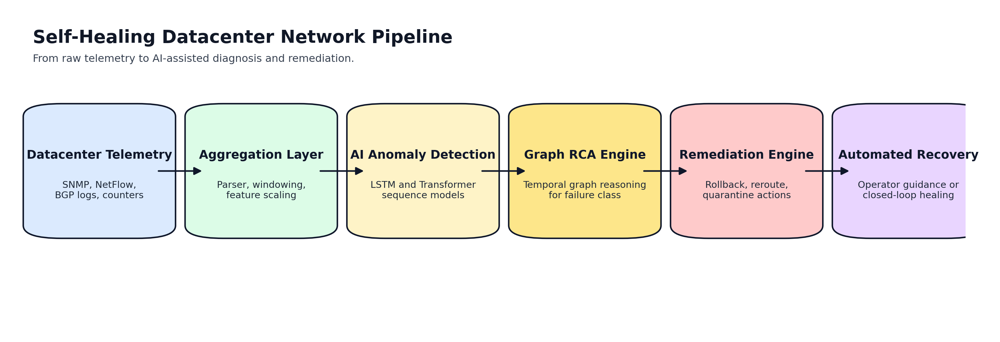
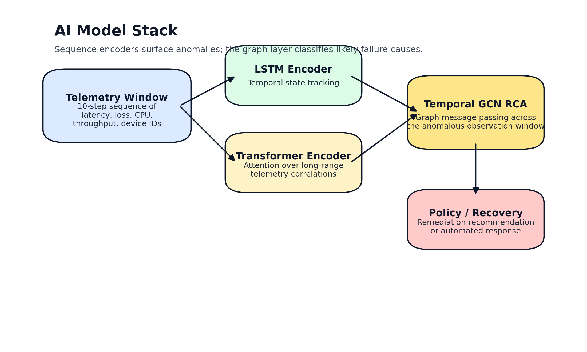
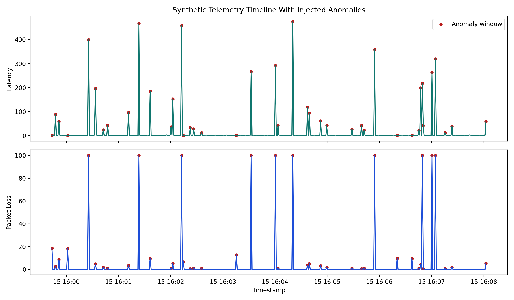
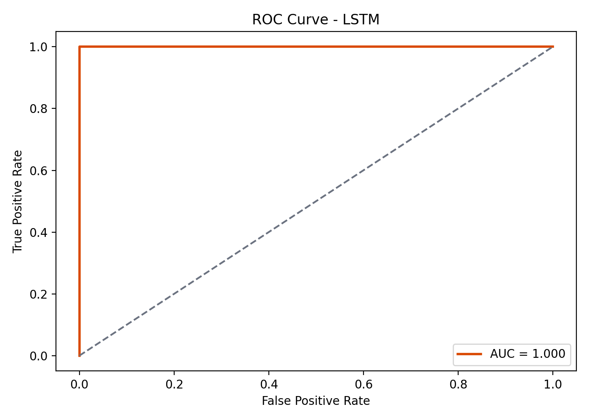
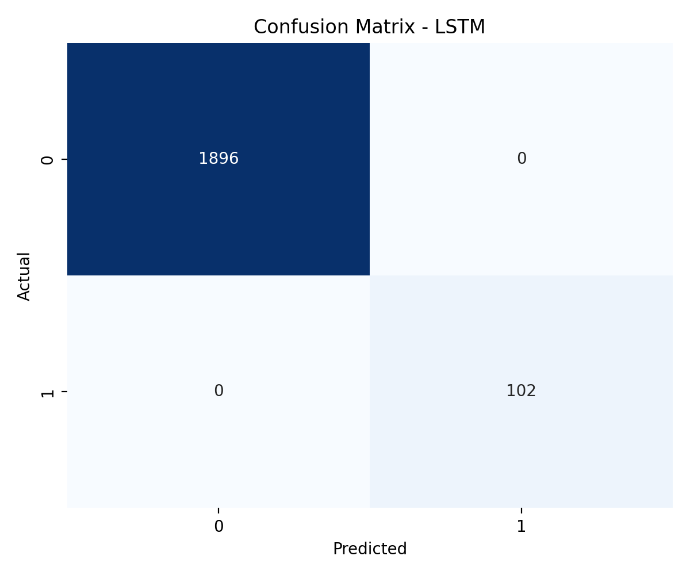

# AI-Driven Root Cause Analysis and Self-Healing Framework for Hyperscale Datacenter Networks

> Note: The current canonical manuscript is the IEEE LaTeX version in `paper.tex` and `paper.pdf`. This Markdown draft is retained as a narrative working document and may lag the latest real-data results.

## Abstract
Hyperscale datacenter networks support cloud computing, artificial intelligence workloads, financial systems, and public-sector digital services. Their failure modes include misconfiguration, congestion, hardware degradation, routing instability, and policy conflicts. Existing monitoring platforms are effective at alarm generation but are often slower at diagnosis and even slower at remediation planning. This paper presents a prototype self-healing framework that combines telemetry aggregation, sequence-based anomaly detection, graph-based root cause analysis, and rule-driven remediation recommendations. On a held-out synthetic telemetry split, both the LSTM and Transformer anomaly detectors achieved 100% accuracy and zero false positives. On a proxy real-data experiment derived from Google Cluster Trace samples, the LSTM model achieved 99.86% accuracy and 98.68% F1. For root cause analysis across anomalous windows, the temporal graph model achieved 85.19% accuracy and 85.03% weighted F1. These results show that AI-assisted diagnosis can materially reduce the time required to detect and triage datacenter faults, while also highlighting the need for richer topology-aware labels and more realistic evaluation environments.

## Introduction
Hyperscale cloud providers such as Amazon Web Services, Google Cloud, and Microsoft Azure operate distributed infrastructures at a scale that makes manual root cause triage increasingly expensive and operationally risky. A single outage can affect thousands of customers, disrupt dependent digital services, and create cascading recovery work for operators. In high-throughput environments, alert fatigue and overlapping telemetry symptoms complicate the identification of the actual initiating fault.

The central research problem is therefore not only anomaly detection, but also fast and reliable attribution. A practical self-healing architecture must answer three questions in sequence:
1. Is the network behavior abnormal?
2. What is the most likely cause?
3. What remediation action should be recommended or triggered?

This repository implements a prototype framework that addresses all three questions within a single pipeline.

## Related Work
Prior work on network anomaly detection commonly relies on recurrent neural networks, autoencoders, and statistical change-point methods. More recent sequence models use Transformers to capture longer-range dependencies across events and metrics. Root cause analysis research frequently uses graph abstractions because faults propagate along dependency edges rather than staying local to the first visible symptom. In operational settings, however, many prototypes stop at detection and do not connect model output to remediations. This project focuses on that end-to-end linkage.

## Problem Statement
Datacenter faults often present with overlapping symptoms:
- Link congestion and routing instability can both appear as latency spikes and packet loss.
- Misconfigurations can resemble hardware failures when interfaces flap or traffic drops to zero.
- BGP instability can create transient congestion, making symptom-based rules alone unreliable.

Traditional monitoring tools detect threshold violations but do not distinguish between these causes quickly enough to support near-real-time recovery. The goal of this work is to build a pipeline that converts raw telemetry into actionable diagnosis and remediation guidance.

## System Architecture
The framework has five stages:
1. Telemetry collection from counters, logs, and flow-like data.
2. Aggregation and preprocessing into time-windowed features.
3. AI anomaly detection with LSTM and Transformer models.
4. Graph-based RCA over anomalous telemetry windows.
5. Rule-based remediation mapping for self-healing actions.

The implementation currently uses synthetic datacenter telemetry plus a proxy real-data experiment. The remediation stage is advisory rather than connected to a live network controller, which keeps the framework safe for experimentation while preserving the research narrative.

## Dataset Description
### Synthetic telemetry dataset
The synthetic dataset contains 10,000 telemetry records representing 10 routers with 4 interfaces each. Each row includes:
- CPU usage
- Latency
- Packet loss
- Throughput
- Router identifier
- Interface identifier
- Binary anomaly label
- Root cause label

The data generator injects four failure classes:
- `congestion`
- `misconfig`
- `hardware_failure`
- `bgp_instability`

After preprocessing with a 10-step sliding window, the training tensor has shape `(9990, 10, 6)`. The anomaly target includes 536 positive windows, while RCA labels are available for the anomalous subset.

### Google Cluster Trace proxy dataset
The repository also includes a small proxy realism pass using sampled Google Cluster Trace files. Because operator-verified incident labels are not available in this sample, anomalies are defined heuristically using a high-CPU threshold after normalization. This experiment is useful for testing generalization mechanics, but it should not be interpreted as full production-grade validation.

## Machine Learning Methodology
### LSTM anomaly detector
The LSTM model treats each telemetry window as a sequence and predicts whether the last point in the window is anomalous. It is designed to capture local temporal dynamics such as latency growth, throughput collapse, or sudden interface degradation.

### Transformer anomaly detector
The Transformer model embeds telemetry windows and applies self-attention to capture longer-range interactions across the observation window. This is useful when a failure signature builds across several time steps rather than appearing as a single sharp change.

### Temporal graph RCA model
The RCA module uses a temporal graph convolutional network. Each time step in the telemetry window is treated as a graph node, and neighboring steps are connected in a normalized chain graph. Message passing across the window lets the model reason over the evolution of a fault pattern before classifying one of four likely root causes. This is a graph-based approximation of RCA and a stepping stone toward a full topology-aware GNN.

### Remediation engine
The remediation engine maps the diagnosed root cause to a recommended action:
- Congestion: reroute traffic or adjust policy preference.
- Misconfiguration: roll back the recent configuration change.
- Hardware failure: isolate the faulty node and fail over to redundant paths.
- BGP instability: reset the session and apply stabilization controls.

## Experimental Setup
All models were trained in PyTorch using deterministic 80/20 train-test splits. The synthetic dataset was generated locally, preprocessed into standardized telemetry windows, and used for both anomaly detection and RCA. The Google Cluster Trace proxy experiment used the same basic sequence modeling pipeline, but only for anomaly detection. Evaluation metrics include:
- Accuracy
- Precision
- Recall
- F1 score
- False positive rate for binary anomaly detection

The evaluation script now recreates the held-out split rather than scoring on the full dataset, which avoids the optimistic leakage present in many prototype pipelines.

## Results and Analysis
### Quantitative results

| Task | Dataset | Model | Accuracy | Precision | Recall | F1 | False Positive Rate |
| :--- | :--- | :--- | ---: | ---: | ---: | ---: | ---: |
| Anomaly detection | Synthetic | LSTM | 1.0000 | 1.0000 | 1.0000 | 1.0000 | 0.0000 |
| Anomaly detection | Synthetic | Transformer | 1.0000 | 1.0000 | 1.0000 | 1.0000 | 0.0000 |
| Anomaly detection | Google Cluster Trace proxy | LSTM | 0.9986 | 0.9962 | 0.9775 | 0.9868 | 0.0002 |
| Root cause analysis | Synthetic anomalous windows | Temporal GCN | 0.8519 | 0.8552 | 0.8519 | 0.8503 | N/A |

### Observations
The synthetic anomaly detection task is perfectly separable even on a held-out split. This indicates that the generator currently injects faults with strong signatures. That is useful for validating pipeline integration, but it also reduces the difficulty of the benchmark.

The proxy real-data result is slightly harder and therefore more informative. Although the accuracy remains high, the experiment is constrained by heuristic labels, so it should be interpreted as a realism check rather than a final deployment claim.

The RCA task is the most meaningful discriminator in the current repository. The temporal graph classifier achieved 85.19% accuracy, demonstrating that root cause attribution is materially harder than binary anomaly detection and is therefore the more valuable research contribution.

## Discussion
The results support three practical conclusions. First, anomaly detection alone is not a sufficient research contribution for this problem area because simplified synthetic data can make the task look artificially easy. Second, graph-based reasoning is a more realistic basis for RCA than pure symptom thresholds, even when implemented here as a temporal graph rather than a full network topology graph. Third, remediation recommendations are essential for moving from monitoring toward self-healing behavior.

The project is particularly relevant to resilient cloud infrastructure because it maps technical outputs directly to operational actions. A diagnosis pipeline that reduces mean time to detect and mean time to identify can improve service continuity and reduce the cost of outages.

## Limitations
- The synthetic telemetry generator does not yet model large-scale topology interactions, shared-risk failures, or noisy operator actions.
- The Google Cluster Trace experiment uses heuristic anomaly labels rather than incident-ground-truth labels.
- The RCA graph is temporal, not yet a full graph over routers, interfaces, links, routes, and policies.
- The remediation engine is rule-based and does not verify action safety against a controller or simulator.

## Future Work
Future extensions should focus on realism, topology, and validation:
1. Replace heuristic labels with incident-linked labels from emulated or production-like traces.
2. Build a topology-aware graph where nodes represent routers, interfaces, links, peers, and policy objects.
3. Compare against non-neural baselines such as Isolation Forest, XGBoost, and graph-free RCA classifiers.
4. Integrate a simulator or lab controller to validate whether proposed remediations actually restore service.
5. Add reinforcement learning or constrained optimization to rank safe remediation options under uncertainty.

## Conclusion
This work demonstrates a practical prototype for AI-driven anomaly detection, root cause analysis, and remediation guidance in datacenter networks. The repository now includes reproducible held-out evaluation, required paper figures, a graph-based RCA model, and exportable paper artifacts. The current evidence is strongest as a prototype for self-healing network operations and a solid base for a more rigorous, topology-aware research paper aimed at critical infrastructure resilience.
